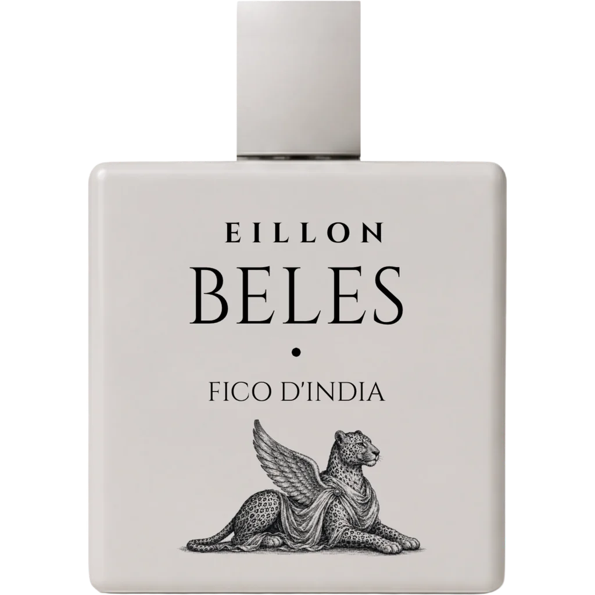

# EILLON Website + Brand Restructure Plan

**For:** Cursor Composer 2.5 / implementation agent  
**Repo:** `knnthhnsn/eillon`  
**Site:** `https://eillon.maison`  
**Goal:** Make the site feel like a complete perfume maison, not a single-product landing page. Separate the **EILLON brand** from the individual perfumes, add a clear **Store / Boutique** structure, and prepare the site for multiple fragrances with statuses like **Waitlist Open**, **In Production**, **Coming Soon**, and **Concept / Lab**.

---

## 1. North-star brand direction

### Positioning

**EILLON is an Afro-Mediterranean memory perfumery maison creating intimate, genderless parfums inspired by Red Sea landscapes, desert fruit, rain on stone, café spices, sacred resins, and warm skin.**

### Brand line

Use this consistently under or near the logo:

> **Afro-Mediterranean Memory Perfumery**

### Commercial tagline

Use for hero sections, metadata, and social cards:

> **Red Sea memories, bottled.**

### Brand hierarchy

EILLON must be understood as the **house**. Perfumes are chapters inside that house.

```txt
EILLON                         = the maison / brand
Afro-Mediterranean Memory      = the niche / universe
The Boutique / Store           = the catalog and purchase/waitlist layer
Beles · Fico d'India           = the first perfume / Chapter I
Asmara                         = future city-rain perfume / in production
Massawa                        = future Red Sea coastal perfume / coming soon
Ritual / Qedem / Traditions    = future resin/incense concept / lab
```

### Tone of voice

Use language that feels premium, sensual, restrained, and specific.

**Use:**

- `oil-rich parfum`
- `close-wearing trail`
- `skin-adherent warmth`
- `sun-warmed prickly pear`
- `mineral desert air`
- `Red Sea memory`
- `warm stone`
- `cactus water`
- `soft musk`

**Avoid:**

- Repeating negative comparisons like `not a cheap alcohol-forward eau de toilette`.
- Over-claiming longevity as guaranteed.
- Calling a product `oil-based` if the INCI/ingredient list includes alcohol denat. Use `oil-rich parfum concentration` unless the formula is truly oil-carrier based.
- Making EILLON sound like only Beles.
- Mixing Asmara/rain copy into Beles pages.

---

## 2. Main audit findings from the current repo

### 2.1 Home page is too product-specific

Current `index.html` metadata positions the homepage as **Beles** instead of **EILLON**:

```html
<title>EILLON — Beles · Fico d'India Parfum · Copenhagen</title>
<meta name="description" content="Beles · Fico d'India by EILLON..." />
```

This makes the maison and the first product feel like the same thing. The homepage should sell the EILLON universe first, then direct people into the boutique.

### 2.2 Beles and Asmara are mixed on the same page

The current home hero says:

```html
A fragrance shaped by rain,
stone, and quiet earth.
```

The story section names **Asmara** and rainfall, but the composition section is **Fico d'India / Beles**. This is the biggest brand-confusion issue.

**Fix:** Home page becomes brand-level. Beles page becomes cactus-fruit/product-level. Asmara becomes a future product card or preview page.

### 2.3 CTA says “Shop Now” while the product is waitlist-only

Current home CTA says `Shop Now`, but the flow is waitlist/pre-order style. This risks disappointing users.

**Fix:** Use `Enter the Boutique`, `Join the Beles Waitlist`, or `Reserve Priority Access`.

### 2.4 The README and CSS still reference old Asmara/Elli Hansen direction

Current `README.md` starts with `Elli Hansen — Asmara`. Current `styles.css` comment says `EILLON — ASMARA`.

**Fix:** Update all project docs/comments to EILLON maison language.

### 2.5 Current waitlist is hardcoded for one product

Current database stores:

```sql
email
source
size
created_at
updated_at
```

That is fine for Beles only, but it will become confusing when Asmara, Massawa, and other concepts are added.

**Fix:** Add `product_slug`, `interest_status`, and optional UTM/source fields.

### 2.6 Admin page security needs tightening

Current `waitlist-admin.html` sends the admin key in the URL query string:

```js
fetch(`/api/waitlist-admin?key=${encodeURIComponent(key)}`)
```

Current admin row rendering uses `innerHTML` with signup data:

```js
row.innerHTML = `
  <td>${signup.email}</td>
  <td>${signup.source}</td>
  <td>${signup.size || '—'}</td>
  <td>${formatDate(signup.created_at)}</td>
`;
```

**Fix:** Send the key with the existing `x-admin-key` header path and render table cells using `textContent`, not `innerHTML`.

### 2.7 Hreflang should be simplified until Danish pages exist

Current home and sitemap point `en`, `da`, and `x-default` to the same URL. If there is no Danish-localized page, remove `da` until a real `/da` page exists.

### 2.8 Product structured data belongs mainly on product pages

Current homepage contains a lot of Product/AggregateOffer schema for Beles. That should move primarily to `/beles`. The homepage should use `Organization`, `WebSite`, and maybe an `ItemList` of fragrances.

---

## 3. Recommended information architecture

Keep the site static and Vercel-friendly. Do not migrate to React/Next unless explicitly requested later.

### Phase 1 route structure

```txt
/                       Maison landing page
/store                  Boutique / collection overview
/beles                  Product page: Beles · Fico d'India
/journal                Editorial index
/journal/fico-d-india   Article
/journal/the-bottle     Article
/privacy                Legal
/terms                  Legal
/imprint                Legal
/waitlist-admin         Private noindex admin view
```

### Optional Phase 2 route structure

If the brand expands, add:

```txt
/perfumes/beles
/perfumes/asmara
/perfumes/massawa
/perfumes/ritual
```

For now, **do not break `/beles`**. Keep it as canonical because it already exists in the sitemap and internal links.

---

## 4. Product catalog model

Create a single source of truth for fragrances.

### New file: `data/products.js`

Because the site is static and has no build step, expose the data on `window`:

```js
window.EILLON_PRODUCTS = [
  {
    slug: 'beles',
    name: 'Beles',
    subtitle: "Fico d'India",
    chapter: 'Chapter I',
    status: 'waitlist-open',
    statusLabel: 'Waitlist open',
    type: 'Oil-rich parfum',
    family: 'Watery fruit musk',
    shortDescription:
      'Sun-warmed prickly pear, cactus water, pear skin, hibiscus, soft musk, and mineral desert air.',
    longDescription:
      'A green-pink cactus fruit parfum built to feel airy, watery, sun-warmed, and close to skin.',
    notes: {
      top: ['Prickly pear', 'Cactus water', 'Pear skin'],
      heart: ['Hibiscus', 'Cactus bloom', 'Green leaves'],
      base: ['Soft musk', 'Mineral air', 'Warm stone']
    },
    palette: ['cream', 'blush pink', 'cactus green', 'mineral aqua', 'sandstone'],
    image: 'images/beles-no-background.webp',
    fallbackImage: 'images/beles-no-background.png',
    url: '/beles',
    ctaLabel: 'Join waitlist',
    waitlistEnabled: true,
    formats: [
      { id: 'sample', label: '2 ml sample', price: 28, currency: 'EUR', status: 'waitlist-open' },
      { id: '50', label: '50 ml', price: 170, currency: 'EUR', status: 'waitlist-open' },
      { id: '100', label: '100 ml', price: 240, currency: 'EUR', status: 'waitlist-open' }
    ]
  },
  {
    slug: 'asmara',
    name: 'Asmara',
    subtitle: 'Rain on Stone',
    chapter: 'Chapter II',
    status: 'in-production',
    statusLabel: 'In production',
    type: 'Parfum concept',
    family: 'Mineral rain amber',
    shortDescription:
      'Warm rain on old stone, espresso, cardamom, jasmine, dust, amber, soft tobacco, and white musk.',
    notes: {
      top: ['Petrichor', 'Bergamot', 'Humid air'],
      heart: ['Espresso', 'Cardamom', 'Jasmine'],
      base: ['Amber', 'Soft tobacco', 'White musk']
    },
    palette: ['wet stone', 'coffee brown', 'jasmine white', 'soft amber'],
    image: 'images/plain-bottle-with-logo.webp',
    url: '/store#asmara',
    ctaLabel: 'Get updates',
    waitlistEnabled: true,
    formats: []
  },
  {
    slug: 'massawa',
    name: 'Massawa',
    subtitle: 'Red Sea Citrus',
    chapter: 'Chapter III',
    status: 'coming-soon',
    statusLabel: 'Coming soon',
    type: 'Parfum concept',
    family: 'Solar citrus marine',
    shortDescription:
      'Red Sea air, sunlit orange, papaya, salt-warmed skin, and mineral coastal stone.',
    notes: {
      top: ['Orange', 'Papaya', 'Sea air'],
      heart: ['Solar flowers', 'Salt skin', 'Warm breeze'],
      base: ['Mineral stone', 'Soft musk', 'Sunlit woods']
    },
    palette: ['sea aqua', 'orange peel', 'salt white', 'sand'],
    image: 'images/plain-bottle-with-logo.webp',
    url: '/store#massawa',
    ctaLabel: 'Notify me',
    waitlistEnabled: true,
    formats: []
  },
  {
    slug: 'ritual',
    name: 'Ritual',
    subtitle: 'Frankincense & Myrrh',
    chapter: 'Lab',
    status: 'concept-lab',
    statusLabel: 'Concept / lab',
    type: 'Parfum study',
    family: 'Sacred resin skin',
    shortDescription:
      'Frankincense, myrrh, candle smoke, amber, warm skin, desert night air, and soft woods.',
    notes: {
      top: ['Bright incense', 'Lemony resin', 'Dry air'],
      heart: ['Myrrh', 'Amber', 'Labdanum'],
      base: ['Sandalwood', 'Patchouli', 'Warm skin']
    },
    palette: ['resin gold', 'smoke grey', 'desert black', 'amber'],
    image: 'images/plain-bottle-with-logo.webp',
    url: '/store#ritual',
    ctaLabel: 'Follow the lab',
    waitlistEnabled: true,
    formats: []
  }
];
```

### Status behavior

| Status | Meaning | Card CTA | Price shown? | Product schema? |
|---|---|---|---|---|
| `waitlist-open` | Product is real and collecting purchase interest | Join waitlist | Yes, if pricing is confirmed | Yes, on product page |
| `in-production` | Formula/product is actively being developed | Get updates | No | No offer yet |
| `coming-soon` | Planned fragrance, not fully developed | Notify me | No | No offer yet |
| `concept-lab` | Idea / experimental direction | Follow the lab | No | No offer yet |

---

## 5. Page-by-page implementation plan

## 5.1 `index.html` — convert to maison landing page

### New homepage purpose

The homepage should answer:

1. What is EILLON?
2. Why does it exist?
3. What world does it belong to?
4. Where can I see the perfumes?

It should **not** behave like the full Beles product page.

### Head/meta changes

Replace product-first metadata with brand-first metadata.

```html
<title>EILLON — Afro-Mediterranean Memory Perfumery</title>
<meta name="description" content="EILLON is an Afro-Mediterranean perfume maison creating intimate, genderless parfums inspired by Red Sea memory, desert fruit, rain on stone, sacred resins, café spices, and warm skin." />
<meta name="keywords" content="EILLON, Afro-Mediterranean perfume, Red Sea fragrance, niche perfume, luxury parfum, Copenhagen perfume house, genderless fragrance" />
<meta property="og:title" content="EILLON — Afro-Mediterranean Memory Perfumery" />
<meta property="og:description" content="Red Sea memories, bottled: desert fruit, rain on stone, sacred resins, café spices, and warm skin." />
```

Remove homepage `product:price` tags. Pricing belongs to `/beles` or `/store`.

### Homepage structured data

Keep:

- `Organization`
- `WebSite`
- `WebPage`

Add optional:

- `ItemList` of fragrances linking to `/store` and `/beles`

Remove or reduce homepage `Product` schema for Beles. Product schema belongs on `/beles`.

### New hero copy

```html
<span class="eyebrow">Afro-Mediterranean Memory Perfumery</span>
<h1 class="hero__title" aria-label="EILLON">EILLON</h1>
<p class="hero__tagline">
  Red Sea memories,<br />
  bottled close to skin.
</p>
<div class="hero__cta">
  <a class="btn btn--primary magnetic" href="/store"><span class="btn__label">Enter the Boutique</span></a>
  <a class="btn btn--ghost magnetic" href="#maison"><span>Discover the Maison</span><span class="arrow">→</span></a>
</div>
```

### Replace the Asmara/Beles mixed story with brand story

New section ID: `maison`.

```html
<section class="story" id="maison">
  <div class="story__grid">
    <div class="story__eyebrow reveal">
      <span class="eyebrow">The Maison</span>
    </div>
    <div class="story__heading">
      <h2 class="display" data-reveal="words">
        Perfume from<br />
        <em>place, memory & skin.</em>
      </h2>
    </div>
    <div class="story__body">
      <p data-reveal="up">
        EILLON composes intimate parfums from Afro-Mediterranean memory: Red Sea air, desert fruit, rain on stone, café spices, sacred resins, and warm skin.
      </p>
      <p data-reveal="up" data-delay="120">
        Each fragrance is a chapter. Beles begins with prickly pear and cactus water. Asmara follows rain on old city stone. Massawa turns toward the Red Sea coast.
      </p>
      <a href="/store" class="link-arrow" data-reveal="up" data-delay="220">
        <span>View the boutique</span>
        <span class="arrow">→</span>
      </a>
    </div>
  </div>
</section>
```

### Add collection preview

Add a new section after `maison`:

```html
<section class="collection-preview" id="collection">
  <header class="section-head">
    <span class="eyebrow">The Collection</span>
    <h2 class="display">Four memories,<br /><em>one maison.</em></h2>
    <p>Beles is the first release. Other chapters are in production, coming soon, or in the lab.</p>
  </header>
  <div class="product-grid" data-product-preview></div>
  <a class="btn btn--ghost" href="/store">Open the Boutique <span class="arrow">→</span></a>
</section>
```

This can be rendered from `window.EILLON_PRODUCTS` or hardcoded.

### Remove/rework the fake press quote

Current quote sounds like a fabricated review. Either remove it or change it to a brand note:

```html
<section class="quote quote--studio-note">
  <blockquote>
    <p data-reveal="words">
      “A perfume should not explain everything. It should leave a trace — fruit, stone, skin, memory.”
    </p>
    <cite data-reveal="up" data-delay="900">— EILLON studio note</cite>
  </blockquote>
</section>
```

---

## 5.2 `store.html` — add the boutique/catalog page

Create a new file: `store.html`.

### Page purpose

The store should make it immediately clear that EILLON is a maison with multiple perfumes, but only some are available for waitlist now.

### Store page structure

```txt
Hero
  “The Boutique”
  “Perfumes from Red Sea memory, desert fruit, rain, resin, and skin.”
  CTA to Beles waitlist

Product grid
  Beles — Waitlist open
  Asmara — In production
  Massawa — Coming soon
  Ritual — Concept / lab

Status guide
  What “waitlist open”, “in production”, “coming soon”, and “lab” mean

Newsletter / all releases form
  “Join The Letter”
```

### Store hero copy

```html
<span class="eyebrow">The Boutique</span>
<h1 class="display">The EILLON<br /><em>fragrance chapters.</em></h1>
<p>
  Beles is open for priority access. Future chapters are being composed slowly — rain on stone, Red Sea citrus, sacred resins, and warm skin.
</p>
```

### Product card markup

Use this card pattern:

```html
<article class="product-card product-card--beles" id="beles">
  <a class="product-card__media" href="/beles" aria-label="View Beles · Fico d'India">
    
  </a>
  <div class="product-card__body">
    <span class="product-card__status product-card__status--waitlist-open">Waitlist open</span>
    <p class="product-card__chapter">Chapter I</p>
    <h2>Beles <span>Fico d'India</span></h2>
    <p>Sun-warmed prickly pear, cactus water, hibiscus, mineral air, and soft musk.</p>
    <ul class="product-card__notes">
      <li>Prickly pear</li>
      <li>Cactus water</li>
      <li>Soft musk</li>
    </ul>
    <a class="btn btn--primary" href="/beles#waitlist">Join waitlist</a>
  </div>
</article>
```

For future products, use the same structure but no price and no product-specific checkout claim:

```html
<article class="product-card" id="asmara">
  <div class="product-card__media product-card__media--placeholder" aria-hidden="true"></div>
  <div class="product-card__body">
    <span class="product-card__status product-card__status--production">In production</span>
    <p class="product-card__chapter">Chapter II</p>
    <h2>Asmara <span>Rain on Stone</span></h2>
    <p>Warm rain on old stone, espresso, cardamom, jasmine, amber, and white musk.</p>
    <a class="btn btn--ghost" href="#letter" data-waitlist-product="asmara">Get updates</a>
  </div>
</article>
```

### Store CSS classes to add

Add to `styles.css`:

```css
.product-grid {
  display: grid;
  grid-template-columns: repeat(4, minmax(0, 1fr));
  gap: clamp(18px, 2vw, 28px);
}

.product-card {
  position: relative;
  min-height: 100%;
  padding: clamp(18px, 2.4vw, 28px);
  border: 1px solid var(--line);
  background: rgba(255, 255, 255, 0.56);
  box-shadow: var(--shadow-soft);
  overflow: hidden;
}

.product-card__media {
  display: grid;
  place-items: center;
  min-height: 280px;
  margin-bottom: 22px;
  background: linear-gradient(180deg, rgba(255,255,255,.75), rgba(250,250,248,.3));
}

.product-card__media img {
  max-height: 320px;
  object-fit: contain;
}

.product-card__status {
  display: inline-flex;
  align-items: center;
  gap: 8px;
  margin-bottom: 16px;
  font-size: 10px;
  letter-spacing: 0.18em;
  text-transform: uppercase;
  color: var(--ink-faint);
}

.product-card__status::before {
  content: '';
  width: 7px;
  height: 7px;
  border-radius: 999px;
  background: currentColor;
}

.product-card__status--waitlist-open { color: var(--gold-dark); }
.product-card__status--production { color: #6f7c62; }
.product-card__status--coming-soon { color: var(--stone); }
.product-card__status--lab { color: var(--ink-soft); }

.product-card h2 {
  font-family: var(--serif);
  font-size: clamp(30px, 3vw, 48px);
  font-weight: 300;
  line-height: .95;
  margin: 0 0 14px;
}

.product-card h2 span {
  display: block;
  margin-top: 8px;
  font-family: var(--sans);
  font-size: 11px;
  letter-spacing: .22em;
  text-transform: uppercase;
}

.product-card__notes {
  display: flex;
  flex-wrap: wrap;
  gap: 8px;
  margin: 18px 0 22px;
}

.product-card__notes li {
  border: 1px solid var(--line);
  border-radius: 999px;
  padding: 6px 10px;
  font-size: 11px;
  letter-spacing: .08em;
  text-transform: uppercase;
}

@media (max-width: 1100px) {
  .product-grid { grid-template-columns: repeat(2, minmax(0, 1fr)); }
}

@media (max-width: 640px) {
  .product-grid { grid-template-columns: 1fr; }
}
```

---

## 5.3 `beles.html` — keep as product page, make Beles purely Beles

### Product positioning

Beles should feel like **watery cactus fruit + sunlit skin + mineral air**. Keep it fresh, airy, pink-green, and sensual.

### Replace overly negative copy

Current style:

> composed in Copenhagen with a high perfume-oil load, not a cheap alcohol-forward eau de toilette.

Replace with:

> composed in Copenhagen as an oil-rich parfum, designed to unfold slowly and wear close to skin.

### Recommended product hero copy

```html
<span class="eyebrow">Chapter I — Waitlist open</span>
<h1 class="display">
  Beles <span class="product-qualifier">• Fico d'India</span><br />
  <em>Prickly pear, mineral air, soft musk.</em>
</h1>
<p class="beles-hero__lead">
  Beles is a green-pink cactus fruit parfum: watery prickly pear, cactus water, pear skin, hibiscus, soft musk, and sun-warmed mineral air.
</p>
```

### Refine facts

```html
<ul class="beles-hero__facts">
  <li>Oil-rich parfum concentration — close, long-wearing trail</li>
  <li>Fico d'India accord: prickly pear, cactus water, hibiscus, soft musk</li>
  <li>Composed in Copenhagen · 2 ml sample, 50 ml, 100 ml</li>
  <li>Waitlist open — priority access at first release</li>
</ul>
```

### Refine composition

```html
Top: Prickly pear · Cactus water · Pear skin
Heart: Hibiscus · Cactus bloom · Green leaves
Base: Soft musk · Mineral air · Warm stone
```

If amber is truly in the formula, keep it as `soft amber` in the base, but do not let it dominate the Beles brand world.

### Product page navigation

Product page nav should make clear where the user is:

```html
<a href="/store">← Boutique</a>
<nav>
  <a href="/">Maison</a>
  <a href="/store">Store</a>
  <a href="/journal">Journal</a>
</nav>
```

### Product schema

Keep product schema on `/beles`, not the homepage. Use `availability: PreOrder` only if the customer will genuinely get first access/pre-order. If this is only an email signup, be conservative and say `waitlist open` on-page without making it look like immediate checkout.

---

## 5.4 Future fragrance status cards

Do not make full product pages for future perfumes until copy, assets, and formulations are ready. Start with store cards.

### Asmara card

```txt
Name: Asmara
Subtitle: Rain on Stone
Status: In production
Short copy: Warm rain on old stone, espresso, cardamom, jasmine, amber, soft tobacco, and white musk.
CTA: Get updates
```

### Massawa card

```txt
Name: Massawa
Subtitle: Red Sea Citrus
Status: Coming soon
Short copy: Red Sea air, orange, papaya, salt-warmed skin, mineral stone, and soft musk.
CTA: Notify me
```

### Ritual / Traditions card

```txt
Name: Ritual
Subtitle: Frankincense & Myrrh
Status: Concept / lab
Short copy: Sacred smoke, lemony frankincense, dark myrrh, amber, desert night air, and warm skin.
CTA: Follow the lab
```

---

## 6. Backend and waitlist improvements

## 6.1 Database migration

Update `scripts/init-db.sql` and `lib/db.js` so the waitlist can support multiple perfumes.

### Suggested schema

```sql
CREATE TABLE IF NOT EXISTS waitlist_signups (
  id SERIAL PRIMARY KEY,
  email TEXT NOT NULL,
  product_slug TEXT NOT NULL DEFAULT 'beles',
  source TEXT NOT NULL DEFAULT 'waitlist',
  size TEXT,
  status TEXT NOT NULL DEFAULT 'active',
  consent_marketing BOOLEAN NOT NULL DEFAULT TRUE,
  utm_source TEXT,
  utm_medium TEXT,
  utm_campaign TEXT,
  created_at TIMESTAMPTZ NOT NULL DEFAULT NOW(),
  updated_at TIMESTAMPTZ NOT NULL DEFAULT NOW(),
  UNIQUE (email, product_slug)
);

CREATE INDEX IF NOT EXISTS waitlist_signups_created_at_idx
  ON waitlist_signups (created_at DESC);

CREATE INDEX IF NOT EXISTS waitlist_signups_product_slug_idx
  ON waitlist_signups (product_slug);
```

### Migration for existing table

Add this migration-safe block:

```sql
ALTER TABLE waitlist_signups
  ADD COLUMN IF NOT EXISTS product_slug TEXT NOT NULL DEFAULT 'beles',
  ADD COLUMN IF NOT EXISTS status TEXT NOT NULL DEFAULT 'active',
  ADD COLUMN IF NOT EXISTS consent_marketing BOOLEAN NOT NULL DEFAULT TRUE,
  ADD COLUMN IF NOT EXISTS utm_source TEXT,
  ADD COLUMN IF NOT EXISTS utm_medium TEXT,
  ADD COLUMN IF NOT EXISTS utm_campaign TEXT;

ALTER TABLE waitlist_signups
  DROP CONSTRAINT IF EXISTS waitlist_signups_email_key;

CREATE UNIQUE INDEX IF NOT EXISTS waitlist_signups_email_product_slug_idx
  ON waitlist_signups (email, product_slug);
```

## 6.2 `api/waitlist.js`

Update validation:

```js
const VALID_PRODUCTS = new Set(['beles', 'asmara', 'massawa', 'ritual', 'all']);
const VALID_SOURCES = new Set(['waitlist', 'newsletter', 'store', 'product-card', 'footer']);
const VALID_SIZES = new Set(['sample', '50', '100']);
```

Normalize payload:

```js
const productSlug = VALID_PRODUCTS.has(payload.product_slug) ? payload.product_slug : 'beles';
const source = VALID_SOURCES.has(payload.source) ? payload.source : 'waitlist';
const size = VALID_SIZES.has(payload.size) ? payload.size : null;
```

Pass product slug to DB:

```js
await upsertSignup({ email, source, size, productSlug, utm });
```

## 6.3 `lib/db.js`

Update insert/upsert:

```js
async function upsertSignup({ email, source, size, productSlug, utm = {} }) {
  const query = getSql();
  await query`
    INSERT INTO waitlist_signups (email, product_slug, source, size, utm_source, utm_medium, utm_campaign)
    VALUES (${email}, ${productSlug || 'beles'}, ${source}, ${size || null}, ${utm.utm_source || null}, ${utm.utm_medium || null}, ${utm.utm_campaign || null})
    ON CONFLICT (email, product_slug) DO UPDATE SET
      source = EXCLUDED.source,
      size = COALESCE(EXCLUDED.size, waitlist_signups.size),
      utm_source = COALESCE(EXCLUDED.utm_source, waitlist_signups.utm_source),
      utm_medium = COALESCE(EXCLUDED.utm_medium, waitlist_signups.utm_medium),
      utm_campaign = COALESCE(EXCLUDED.utm_campaign, waitlist_signups.utm_campaign),
      updated_at = NOW()
  `;
}
```

Update admin list:

```js
SELECT email, product_slug, source, size, status, created_at, updated_at
FROM waitlist_signups
ORDER BY created_at DESC
```

---

## 7. Admin page security fixes

## 7.1 Do not send admin key in URL

Current API accepts `x-admin-key`. Use it.

### Replace in `waitlist-admin.html`

```js
const res = await fetch('/api/waitlist-admin', {
  headers: { 'x-admin-key': key }
});
```

### Then update `api/waitlist-admin.js`

Remove query param support if possible:

```js
function getKey(req) {
  return String(req.headers['x-admin-key'] || '');
}
```

## 7.2 Replace `innerHTML` with safe cell creation

```js
const appendCell = (row, value) => {
  const cell = document.createElement('td');
  cell.textContent = value || '—';
  row.appendChild(cell);
};

signups.forEach((signup) => {
  const row = document.createElement('tr');
  appendCell(row, signup.email);
  appendCell(row, signup.product_slug);
  appendCell(row, signup.source);
  appendCell(row, signup.size || '—');
  appendCell(row, formatDate(signup.created_at));
  rowsEl.appendChild(row);
});
```

## 7.3 Rotate admin key

If the current admin key has been copied into docs, chat, or any non-secret location, rotate `WAITLIST_ADMIN_KEY` in Vercel and delete the old key from notes.

---

## 8. Frontend script changes

Current `script.js` assumes one product and one selected size. Generalize waitlist forms.

### HTML form attributes

For Beles product page:

```html
<form class="shop__waitlist" data-waitlist-form data-product-slug="beles" data-source="waitlist" novalidate>
  <input type="email" name="email" autocomplete="email" required />
  <input type="hidden" name="product_slug" value="beles" />
  <input type="text" name="website" class="shop__honeypot" tabindex="-1" autocomplete="off" aria-hidden="true" />
  <button type="submit" class="btn btn--primary"><span class="btn__label">Join waitlist</span></button>
  <p class="shop__waitlist-status" aria-live="polite"></p>
</form>
```

For store/future products:

```html
<form class="mini-waitlist" data-waitlist-form data-product-slug="asmara" data-source="product-card" novalidate>
  <input type="email" name="email" placeholder="Email for Asmara updates" autocomplete="email" required />
  <button type="submit">Get updates</button>
  <p aria-live="polite"></p>
</form>
```

### JS behavior

- Use `document.querySelectorAll('[data-waitlist-form]')`.
- Derive `product_slug` from `form.dataset.productSlug`.
- Use localStorage key `eillon-waitlist-${productSlug}`.
- Pass selected size only for Beles.
- Keep newsletter separate with `product_slug: 'all'`.

Pseudo-implementation:

```js
const setupWaitlistForm = (form) => {
  const productSlug = form.dataset.productSlug || form.querySelector('[name="product_slug"]')?.value || 'beles';
  const source = form.dataset.source || 'waitlist';
  const statusEl = form.querySelector('[aria-live="polite"]');
  const submitButton = form.querySelector('button[type="submit"]');
  const emailInput = form.querySelector('input[type="email"]');
  const storageKey = `eillon-waitlist-${productSlug}`;

  form.addEventListener('submit', async (e) => {
    e.preventDefault();
    const honeypot = form.querySelector('input[name="website"]');
    if (honeypot?.value) return;
    if (!emailInput?.checkValidity()) {
      emailInput?.reportValidity();
      return;
    }

    const size = form.querySelector('[name="size"]')?.value || selectedSize || null;

    await submitWaitlistSignup({
      email: emailInput.value.trim(),
      source,
      size,
      product_slug: productSlug
    });
  });
};

document.querySelectorAll('[data-waitlist-form]').forEach(setupWaitlistForm);
```

---

## 9. SEO and structured data plan

## 9.1 Homepage

Use:

- `Organization`
- `WebSite`
- `WebPage`
- optional `ItemList` for product collection

Avoid:

- Product price meta
- Product schema as primary object
- Beles-specific title/description

## 9.2 Store page

Use:

- `CollectionPage`
- `ItemList`

Example:

```json
{
  "@context": "https://schema.org",
  "@type": "CollectionPage",
  "name": "EILLON Boutique",
  "url": "https://eillon.maison/store",
  "description": "The EILLON fragrance chapters: Beles, Asmara, Massawa, and ritual resin studies.",
  "mainEntity": {
    "@type": "ItemList",
    "itemListElement": [
      { "@type": "ListItem", "position": 1, "url": "https://eillon.maison/beles", "name": "Beles · Fico d'India" },
      { "@type": "ListItem", "position": 2, "url": "https://eillon.maison/store#asmara", "name": "Asmara" },
      { "@type": "ListItem", "position": 3, "url": "https://eillon.maison/store#massawa", "name": "Massawa" }
    ]
  }
}
```

## 9.3 Beles product page

Use:

- `Product`
- `Brand`
- `BreadcrumbList`
- `FAQPage`

Only include `Offer` prices if they are final. If no immediate checkout exists, be careful with merchant listing expectations.

## 9.4 Hreflang

Until there are actual translated pages, use only:

```html
<link rel="alternate" hreflang="en" href="https://eillon.maison/" />
<link rel="alternate" hreflang="x-default" href="https://eillon.maison/" />
```

Or remove hreflang entirely until localized URLs exist.

Do not point `da` to the English page unless a proper Danish equivalent exists.

## 9.5 `sitemap.xml`

Add `/store` and remove incomplete localization hints until true translated pages exist.

Suggested sitemap entries:

```xml
<url>
  <loc>https://eillon.maison/</loc>
  <lastmod>2026-06-17</lastmod>
  <changefreq>weekly</changefreq>
  <priority>1.0</priority>
</url>
<url>
  <loc>https://eillon.maison/store</loc>
  <lastmod>2026-06-17</lastmod>
  <changefreq>weekly</changefreq>
  <priority>0.95</priority>
</url>
<url>
  <loc>https://eillon.maison/beles</loc>
  <lastmod>2026-06-17</lastmod>
  <changefreq>weekly</changefreq>
  <priority>0.9</priority>
</url>
```

## 9.6 `llms.txt`

Update the LLM context so AI/search assistants understand EILLON as a maison, not only Beles.

```txt
# EILLON

> Afro-Mediterranean memory perfumery. Red Sea memories, bottled.

## Brand
- Name: EILLON
- Category: Independent perfume maison
- Niche: Afro-Mediterranean memory perfumery
- Location: Copenhagen, Denmark
- Website: https://eillon.maison
- Email: care@eillon.maison

## Fragrance chapters
- Beles · Fico d'India — Waitlist open. Prickly pear, cactus water, hibiscus, mineral air, soft musk.
- Asmara — In production. Rain on stone, espresso, cardamom, jasmine, amber, white musk.
- Massawa — Coming soon. Red Sea air, orange, papaya, salt skin, mineral coastal stone.
- Ritual — Concept/lab. Frankincense, myrrh, sacred smoke, amber, warm skin.

## Key pages
- Maison: https://eillon.maison/
- Store: https://eillon.maison/store
- Beles product: https://eillon.maison/beles
- Journal: https://eillon.maison/journal
```

---

## 10. Copy system

## 10.1 Homepage copy

### Hero

```txt
EILLON
Afro-Mediterranean Memory Perfumery
Red Sea memories, bottled close to skin.
```

### Brand paragraph

```txt
EILLON composes intimate parfums from Afro-Mediterranean memory: Red Sea air, desert fruit, rain on stone, café spices, sacred resins, and warm skin.
```

### Collection intro

```txt
Each fragrance is a chapter. Beles begins with prickly pear and cactus water. Asmara follows rain on old city stone. Massawa turns toward the Red Sea coast.
```

## 10.2 Store copy

```txt
The Boutique
The EILLON fragrance chapters.
Beles is open for priority access. Future chapters are being composed slowly — rain on stone, Red Sea citrus, sacred resins, and warm skin.
```

## 10.3 Beles copy

```txt
Beles · Fico d'India
Watery prickly pear, cactus bloom, mineral air, and soft musk.

Beles is a green-pink cactus fruit parfum: sun-warmed, airy, and gently sensual. It opens with prickly pear and cactus water, softens into hibiscus and green leaves, then settles close to skin with clean musk and mineral stone.
```

## 10.4 Status microcopy

```txt
Waitlist open — Priority access before public release.
In production — Formula and object are being refined.
Coming soon — A future chapter from the EILLON universe.
Concept / lab — A study in progress from the studio archive.
```

---

## 11. Files to update or create

### Create

```txt
data/products.js
store.html
```

### Update

```txt
index.html
beles.html
styles.css
script.js
api/waitlist.js
api/waitlist-admin.js
lib/db.js
scripts/init-db.sql
waitlist-admin.html
sitemap.xml
llms.txt
README.md
```

### Optional later

```txt
asmara.html
massawa.html
ritual.html
journal/asmara.html
journal/massawa.html
```

---

## 12. Implementation order for Composer 2.5

### Step 1 — Brand cleanup

- Update `README.md` title and project description.
- Update `styles.css` header comment from Asmara to EILLON design system.
- Update homepage title/meta/OG from Beles-specific to EILLON maison-specific.
- Replace hero CTA `Shop Now` with `Enter the Boutique`.
- Remove Asmara copy from the Beles/home mixed sections.

### Step 2 — Create the product model

- Add `data/products.js`.
- Include Beles, Asmara, Massawa, and Ritual entries.
- Add script tag where needed:

```html
<script src="data/products.js" defer></script>
```

If rendering with JS, make sure it loads before the render logic.

### Step 3 — Add `/store`

- Create `store.html`.
- Reuse existing typography/nav/footer styles.
- Add product grid using the product card pattern.
- Link Beles to `/beles`.
- Future product CTAs should collect notifications or link to the newsletter section, not pretend to sell.

### Step 4 — Refactor homepage

- Home = brand/maison.
- Include a short product preview, but no full shop module.
- Direct traffic to `/store` and `/beles`.

### Step 5 — Refine `/beles`

- Beles = pure product story.
- Replace negative `not cheap...` language.
- Use consistent `oil-rich parfum` terminology.
- Keep waitlist form.
- Add breadcrumb to Store.

### Step 6 — Generalize waitlist

- Update DB schema.
- Update API validation.
- Update frontend forms.
- Admin page displays `product_slug` and `source`.

### Step 7 — Fix admin security

- Use `x-admin-key` header.
- Remove query key from frontend and, ideally, backend.
- Render cells safely with `textContent`.
- Rotate the admin key in Vercel if it has been shared anywhere.

### Step 8 — SEO files

- Update `sitemap.xml` with `/store`.
- Update `llms.txt` to maison/product hierarchy.
- Remove `da` hreflang until actual Danish pages exist.
- Move/reduce Product schema on homepage.

### Step 9 — Test

Run locally:

```bash
npx serve .
```

Test these URLs:

```txt
/
/store
/beles
/journal
/journal/fico-d-india
/journal/the-bottle
/privacy
/terms
/imprint
/waitlist-admin
```

Check:

- Mobile nav opens/closes.
- Search panel still works or is updated for Store.
- Waitlist works for Beles.
- Future product notification forms pass correct `product_slug`.
- Admin table displays product/source/size safely.
- Reduced motion still behaves correctly.
- No console errors.
- No broken image paths.
- `sitemap.xml` is valid XML.
- Rich Results Test validates `/beles` product schema.

---

## 13. Acceptance criteria

The implementation is complete when:

1. Home page clearly presents **EILLON** as the maison, not Beles only.
2. `/store` exists and lists Beles, Asmara, Massawa, and Ritual with clear status labels.
3. Beles has a dedicated product page and remains accessible at `/beles`.
4. Asmara/rain copy no longer appears as the main Beles/home story.
5. CTAs are honest: no `Shop Now` unless there is real checkout.
6. Product statuses are visually clear: Waitlist Open, In Production, Coming Soon, Concept/Lab.
7. Waitlist data includes `product_slug`.
8. Admin page no longer sends admin keys via query string and no longer uses `innerHTML` for signup rows.
9. README, `llms.txt`, sitemap, meta titles, and structured data reflect the new brand architecture.
10. The site still works as a static Vercel deployment with `cleanUrls: true`.

---

## 14. Composer 2.5 prompt to use

Copy this into Composer if needed:

```txt
You are editing the static Vercel site for EILLON in this repository. Do not migrate frameworks. Preserve the existing luxury editorial visual language, typography, and available assets, but restructure the content architecture so EILLON is the maison and Beles is only the first perfume.

Implement the plan in `eillon_composer_implementation_plan.md`.

High priority:
1. Convert `index.html` from Beles-specific to EILLON maison landing page using the positioning “Afro-Mediterranean Memory Perfumery” and tagline “Red Sea memories, bottled.”
2. Create `store.html` as the Boutique page listing Beles, Asmara, Massawa, and Ritual with statuses: Waitlist open, In production, Coming soon, Concept/lab.
3. Keep `/beles` as the flagship product page, refine copy to be purely Beles/cactus-fruit focused, and remove negative “not cheap alcohol-forward” language.
4. Add a shared product catalog file `data/products.js` using `window.EILLON_PRODUCTS`.
5. Generalize waitlist forms and API to include `product_slug`.
6. Fix admin security: use `x-admin-key` header instead of query string and render rows with `textContent`, not `innerHTML`.
7. Update `README.md`, `llms.txt`, `sitemap.xml`, and structured data to reflect EILLON maison + store + product hierarchy.

Do not remove existing assets. Do not break `/beles`. Keep the site deployable on Vercel with `cleanUrls: true`. After changes, verify `/`, `/store`, `/beles`, `/journal`, and `/waitlist-admin` work without console errors.
```
